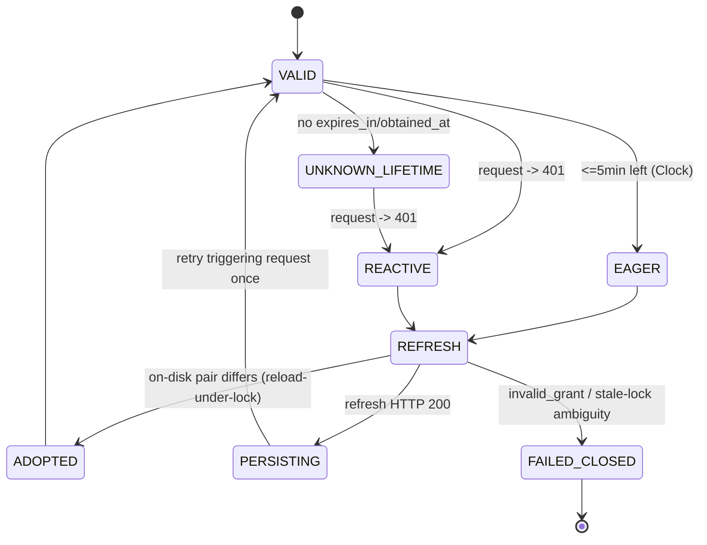

# 02 — Architecture

## 1. Goals & non-goals

**Goals**

1. Give LLM agents a *safe, legible* bridge to the X API v2 — typed tools, curated
   outputs, deterministic errors — not a 1:1 REST mirror.
2. Make writes impossible to trigger accidentally: everything mutating is gated by the
   two-axis policy model ([04-security.md](04-security.md) §3).
3. Survive the platform's pay-per-use economics: respect rate limits, price every call
   from a static cost table, and keep spend inside an operator-set **session credit
   budget** (sparse field selection, capped pagination — §7).
4. Stay operable by one person: exactly two runtime dependencies (the MCP SDK + zod —
   see §2), single-file config, no daemon, no database.

**Non-goals**: streaming ingestion (filtered stream is Phase 4 at earliest, see
[06-roadmap.md](06-roadmap.md)), multi-user OAuth flows, any storage of fetched
content.

## 2. Stack

Identical to the servicenow-mcp-ai family conventions:

- TypeScript **strict**, ESM (`"type": "module"`), Node ≥ 20.
- **Runtime dependencies — exactly two, and this is the authoritative statement for the
  whole corpus:** `@modelcontextprotocol/sdk` (^1.x, stdio transport) and `zod` (config
  validation + tool input schemas). Nothing else ships at runtime. **`undici` is *not* a
  runtime dependency** — Node ≥ 20 bundles it (the server uses the platform HTTP client),
  so `undici` is a **dev** dependency only, pinned for `MockAgent` in tests. Local `.env`
  files are loaded with Node's built-in **`--env-file`** flag (Node ≥ 20.6); **`dotenv`
  is not used.** This single statement supersedes any earlier "SDK + undici" or "~2 deps
  (SDK, dotenv)" phrasing elsewhere in the corpus — the dep budget is two runtime
  packages by design ([09 §7](09-parallel-execution-plan.md)).
- **stdio transport** (v1); Streamable HTTP is a possible Phase 4 addition, never a v1
  requirement.
- Build: bare `tsc` to `build/`, executable bit on `build/index.js`, CJS launcher in
  `bin/x-mcp-ai.cjs` for `npx` compatibility; the `authorize` / `doctor` subcommands
  (`cli/`, §3) compile into `build/` and ship with the package.
- Tests: `node --test` + `undici` `MockAgent`, coverage via `c8` with gates.
- Lint/format: eslint flat config + prettier, `npm run verify` / `npm run check`
  pipelines mirroring servicenow-mcp-ai.

## 3. Module layout (ports & adapters)

```
src/
  index.ts            # composition root: read process.env + profiles file → parseConfig
                      #   → wire adapters → start stdio server (does the I/O core cannot)
  core/               # pure domain logic, no I/O, no SDK imports
    config.ts         #   parseConfig(env, profilesJson?) → validated Config (zod); pure
    policy.ts         #   two-axis policy model: classify(tool) × resolve(env) → allow/deny
    budget.ts         #   session credit-budget counter: atomic check-and-reserve (§7)
    errors.ts         #   typed error taxonomy types (auth, forbidden, billing, budget, ...)
    ports.ts          #   injection seams: Clock, Sleep, Random, TokenStore, dispatcher
    tooldef.ts        #   the ToolDef shape (registry-as-data: name, class, availability,
                      #   scopes, endpointClass, annotations, input schema, handler)
    registry.ts       #   registry-as-data + the single pipeline wrapper (§6 choke point)
    render.ts         #   API JSON → compact LLM-facing shapes (post, user, dm, list)
    render-shapes.ts  #   the compact shape types (frozen contract)
    sanitize.ts       #   untrusted-content pipeline: zero-width/bidi strip, length caps
    resolve.ts        #   id / @handle / status-URL resolution + per-process cache
    paginate.ts       #   pagination contract helper (opaque token round-trip, clamping)
    fields.ts         #   curated field/expansion presets per read shape (§8)
  api/                # the X API adapter (the only module that talks HTTP)
    http.ts           #   undici client, host-scoped auth injection, retry/backoff policy
    ratelimit.ts      #   per-endpoint-class limit tracking from response headers
    errors.ts         #   (status, headers, body) → typed XError mapping + remediation text
    oauth2/           #   OAuth 2.0 token manager — the refresh state machine (§4A)
      machine.ts      #     in-memory single-flight refresh state machine
      filestore.ts    #     file TokenStore: 0600, atomic tmp+rename, O_EXCL|O_NOFOLLOW locks
      index.ts        #     integration: reload-under-lock, adopt-on-disk-pair, persist-before-use
      keychain.ts     #     OS-keychain TokenStore backend (X_MCP_TOKEN_KEYCHAIN; Phase 3)
    oauth1.ts         #   HMAC-SHA1 request signing (Phase 3, only if kept — roadmap Q3)
    endpoints/        #   thin typed wrappers: posts.ts, users.ts, dm.ts, lists.ts, ...
  cli/                # bin subcommands, compiled into build/ so they ship
    authorize.ts      #   PKCE authorize: CSRF state, one-shot 127.0.0.1 listener, --manual
    doctor.ts         #   env/paths/perms validation, resolved auth+policy print, exit 0/1
  mcp/                # MCP adapter
    server.ts         #   McpServer wiring, capability negotiation, tool registration
    schema.ts         #   zod → JSON-schema input definitions shared by tools
    structured.ts     #   outputSchema + structuredContent parity (Phase 3, WP-3.8)
  tools/              # one file per tool package; each exports ToolDef[]
    auth.ts  posts.ts  search.ts  timelines.ts  engagement.ts
    users.ts  graph.ts  dm.ts  lists.ts  media.ts  spaces.ts  trends.ts
```

Dependency rule: `tools → core + api/endpoints`, `api → core`, `mcp → tools + core`,
`cli → core + api`. `core` imports nothing from the other layers and performs **no I/O**
— `parseConfig` takes an injected `env` object plus optional parsed profiles JSON (the
composition root reads `process.env` and the profiles file), so `core` is exhaustively
unit-testable without mocks (ARCH-F8).

These module boundaries double as the exclusive-ownership boundaries for parallel
development — see [09-parallel-execution-plan.md](09-parallel-execution-plan.md) §2.
The file list above is kept in sync with that ownership map (the `ports.ts`,
`tooldef.ts`, `registry.ts`, `render-shapes.ts`, `sanitize.ts`, `resolve.ts`,
`paginate.ts` files, the `api/errors.ts` mapper, and the `oauth2/` and `cli/`
directories).

## 4. Configuration & profiles

All config is passed via **environment variables** (12-factor). `core/config` exposes a
pure `parseConfig(env, profilesJson?)` that validates with zod and returns a typed
`Config`; the composition root (`index.ts` and the `cli/` subcommands) reads
`process.env` and, if used, the profiles file, then calls it (ARCH-F8). On any fatal
config error the server prints one `x-mcp-ai: fatal: <reason>` line to stderr and exits
non-zero (CFG-5) — it never starts on invalid config.

This table is the **canonical, single source of truth** for the env-var surface (a
frozen Wave-0 contract, [09 §3](09-parallel-execution-plan.md)). Any other doc that
lists an `X_MCP_*` variable defers to this one.

| Variable | Default | Meaning |
|---|---|---|
| `X_MCP_AUTH_MODE` | `oauth2` | `oauth2` \| `oauth1` \| `app-only` |
| `X_MCP_CLIENT_ID` | — | OAuth 2.0 app client id (public-client PKCE needs only this) |
| `X_MCP_CLIENT_SECRET` | — | OAuth 2.0 client secret — confidential clients only |
| `X_MCP_TOKEN_FILE` | resolved (see below) | Path to the rotating OAuth 2.0 token store (written by `x-mcp-ai authorize`) |
| `X_MCP_TOKEN_KEYCHAIN` | `0` | `1` → store tokens in the OS keychain instead of a file (Phase 3); mutually exclusive with an explicit `X_MCP_TOKEN_FILE` |
| `X_MCP_API_KEY` / `X_MCP_API_SECRET` / `X_MCP_ACCESS_TOKEN` / `X_MCP_ACCESS_SECRET` | — | OAuth 1.0a quadruple (Phase 3, only if kept — roadmap Q3) |
| `X_MCP_BEARER_TOKEN` | — | App-only bearer token |
| `X_MCP_POLICY` | `read-only` | Preset: `read-only` \| `engage` \| `publish` \| `manage` \| `full` ([04 §3](04-security.md)) |
| `X_MCP_POLICY_ALLOW` / `X_MCP_POLICY_DENY` | — | Comma-separated `op:domain` cell overrides on top of the preset; **deny always wins** (POL-2) |
| `X_MCP_HIDE_DENIED` | `0` | `1` → drop policy-denied tools from registration entirely; default keeps them registered + annotated (POL-7) |
| `X_MCP_CREDIT_BUDGET` | — (no cap) | Session credit budget in **USD** (decimal), operator-set and model-immutable (§7, COST-1) |
| `X_MCP_BUDGET_MODE` | `warn` | `warn` (past-cap results carry `budget_warning`) \| `hard` (reads **and** writes fail with the typed `budget` error) |
| `X_MCP_AVAILABILITY` | conservative (none) | Which account-gated surface is reachable; gates only `pilot`/`premium-user`/`enterprise` tool registration (archive & `user_search` are `app+user`, budget-guarded), surfaced in `auth_status`. Value vocabulary is defined by [01](01-api-landscape.md) (WP-0.10) |
| `X_MCP_MEDIA_DIR` | — (default-deny) | **Required** for `media_upload`; every upload must `realpath` inside it (SEC-T9/MEDIA-5) |
| `X_MCP_PROFILES_FILE` | — | JSON file defining multiple named accounts (work/personal/bot) |
| `X_MCP_PROFILE` | — | Selects the active profile; **required** when `X_MCP_PROFILES_FILE` is set |
| `X_MCP_BASE_URL` | `https://api.x.com` | API base override; env-only, must be `https://`; a non-`*.x.com` host also requires `X_MCP_ALLOW_INSECURE_BASE_URL=1` (CFG-7) |
| `X_MCP_ALLOW_INSECURE_BASE_URL` | `0` | Dev flag enabling a non-`*.x.com` `X_MCP_BASE_URL` |
| `X_MCP_TIMEOUT_MS` | `30000` | Per-**HTTP-request** timeout (not per tool call — one tool may make several requests) |
| `X_MCP_LOG_LEVEL` | `info` | `silent` \| `error` \| `info` \| `debug` (§9) |

**Removed / never add** (folded away by the review pass): `X_MCP_READ_BUDGET` and
`X_MCP_READ_BUDGET_MODE` (the monthly read-budget model) are **gone** — replaced by
`X_MCP_CREDIT_BUDGET` + `X_MCP_BUDGET_MODE` above. There is **no** `ignore_budget`
per-call tool parameter: a model-set override would defeat the budget it exists to
enforce (ARCH-F3). The budget lives in operator space only.

**Validation rules** (all at startup):
- **Empty string = unset** for optional vars, and the same error as *missing* for
  required ones — never a valid value (CFG-4).
- **Unknown `X_MCP_*`** variables produce a startup **warning**, not a refusal — typo
  detection (`X_MCP_POLCY=full` must not silently run the default policy) (CFG-8).
- Invalid policy cells / preset names refuse startup and list the valid cells (POL-6).

**Path handling:**
- **`~` expansion:** a **leading** `~/` (or a bare `~`) in any path-valued var
  (`X_MCP_TOKEN_FILE`, `X_MCP_PROFILES_FILE`, `X_MCP_MEDIA_DIR`) expands to
  `os.homedir()`; a mid-string `~` is left untouched (CFG-1). MCP clients pass env
  values verbatim and Node never expands `~` itself, so the server must.
- **Token-file default** (OAuth2 mode, `X_MCP_TOKEN_FILE` unset):
  `$XDG_CONFIG_HOME/x-mcp/tokens.json`, falling back to `~/.config/x-mcp/tokens.json`
  on macOS/Linux and `%APPDATA%\x-mcp\tokens.json` on Windows (CFG-2). No hardcoded `/`
  joins — backslash paths and drive letters work (PLAT-3).
- The config directory is **`x-mcp`** on every platform — the npm package name
  `x-mcp-ai` deliberately does **not** leak into filesystem paths (CFG-2).

**Profiles-file vs direct-credentials conflict (CFG-3):** if `X_MCP_PROFILES_FILE` is
set, `X_MCP_PROFILE` is **required**, and any *direct* credential var present alongside
it — `X_MCP_BEARER_TOKEN`, `X_MCP_CLIENT_ID`, or the OAuth 1.0a quadruple — is a
**startup error naming both sources**. No silent precedence: ambiguity fails loud (this
is how a wrong-account write is prevented). The profiles file is a secret (POSIX `0600`,
warn on wider perms; its policy cells are re-validated at load — CFG-6/SEC-T16).

**Profiles** mirror servicenow-mcp-ai's multi-instance model: a profiles file maps
`name → {auth mode, credentials or token file, policy}`. Exactly one profile is active
per server process (selected by `X_MCP_PROFILE`); running two accounts concurrently
means two MCP server entries. A `profile_current` block inside `auth_status` output
makes the active identity unmistakable to the agent — critical before any write.

## 4A. OAuth 2.0 refresh state machine

Refresh-token rotation is the highest-risk mechanic in the project: X invalidates the
old refresh token when a new one is issued, so **two refreshes with the same token can
lock the account** (the top asset in the threat model, [04 §1](04-security.md)).
BLOCKER 2 of the reviews (ARCH-F1, SEC-F1) is that the original "advisory lockfile"
design serialized the *critical section* but did nothing about a **stale in-memory
refresh token** — a waiter that acquired the lock would then refresh with the token it
had read *before* waiting, double-spending a rotation a peer already performed. This
section specifies the full algorithm as text now; the code lands in Phase 2
(`api/oauth2/`, [08 WP-2.1](08-implementation-roadmap.md), tasks T-201/T-202/T-203).
The `TokenStore` port lives in `core/ports.ts`.

**Invariants**
1. **Single-flight (in-process):** N concurrent callers share **one** refresh promise;
   never N refreshes (AUTH-2, CONC-1).
2. **Reload-under-lock / adopt-on-disk-pair:** after taking the cross-process lock the
   token file is **re-read**; if the on-disk pair differs from the in-memory one, the
   on-disk pair is **adopted** and the refresh is skipped (AUTH-3, SEC-F1). This is the
   rule that prevents burning a peer's rotation.
3. **Reload-on-401:** any 401 reloads the file under the lock **before** deciding to
   refresh — a peer on the same `X_MCP_TOKEN_FILE` may have already rotated (AUTH-4).
4. **Persist-before-use:** a refreshed pair is written to disk (atomic `tmp`+`rename`,
   `0600`) **before** the new access token is used on any request (AUTH-1). A crash
   between the token response and the persist must never leave a used-but-unsaved
   rotation.
5. **Fail-closed, never break-and-refresh:** on any ambiguity the server emits a typed
   `auth` error with the recovery instruction `npx x-mcp-ai authorize`; it never retries
   into a second refresh of the same token (AUTH-5/AUTH-8).

**States** (per-process token manager)

| State | Meaning / exit |
|---|---|
| `VALID` | Access token has > 5 min of life → used directly. |
| `UNKNOWN_LIFETIME` | `expires_in`/`obtained_at` missing → eager refresh disabled; rely on the reactive-401 path (AUTH-11). |
| `EAGER` | ≤ 5 min of life left (via the injected `Clock`) → enter `REFRESH` before the request (AUTH-7). |
| `REACTIVE` | A token-bearing request returned 401 → enter `REFRESH` (at most once per triggering request). |
| `REFRESH` | Single-flight critical section: acquire lock → reload → maybe refresh. Concurrent callers **await the shared promise** instead of entering. |
| `ADOPTED` | Under lock the on-disk pair differed → adopt it, skip the HTTP refresh → `VALID` (AUTH-3). |
| `PERSISTING` | Refresh succeeded → write the new pair atomically before use (AUTH-1) → `VALID`. |
| `FAILED_CLOSED` | Refresh rejected, or stale-lock ambiguity → terminal typed `auth` error (AUTH-5/8). |



**`REFRESH` critical section (the single-flight body)**
1. If a refresh promise already exists in this process, **await it**, then re-read the
   in-memory pair and use it — do not start a second refresh (AUTH-2).
2. **Acquire the cross-process lock:** create `<token-file>.lock` with
   `O_CREAT|O_EXCL|O_NOFOLLOW`, mode `0600`, in the **token file's directory** (same
   filesystem, so the later `rename` is atomic). Lock content is `{pid, timestamp}`
   (AUTH-5, SEC-T13).
3. **Reload under the lock** (AUTH-3/4): re-read the token file.
   - On-disk pair **differs** from in-memory → **adopt** it, release the lock, **skip
     the refresh** (`ADOPTED` → `VALID`).
   - On-disk pair **matches** → proceed to refresh.
4. **Refresh HTTP call:** POST the current refresh token to the token endpoint with a
   timeout **strictly below** the 30 s staleness threshold (e.g. 25 s) so a hung refresh
   can never outlive its own lock's staleness window (AUTH-5).
   - Rejected (`invalid_grant` / 400 / 401) → release lock, `FAILED_CLOSED` (AUTH-8). No
     retry loop.
   - `200` → **non-rotating tolerance** (AUTH-6): if the response carries a new
     `refresh_token`, use it; if it omits one, **retain** the old one; if it repeats the
     same value, persist without error. Rotation is observed behavior, never assumed.
5. **Persist-before-use** (AUTH-1): write `{access_token, refresh_token, scopes,
   obtained_at, expires_in}` to a tmp file (`O_CREAT|O_EXCL|O_NOFOLLOW`, `0600`) and
   `rename` over the token file (win32 rename-over-open-file retried briefly, then
   surfaced as `auth` — PLAT-1) **before** the new access token is used on any request.
6. **Release the lock**, update the in-memory pair, resolve the shared promise. The
   triggering 401 request is retried **exactly once**; a second 401 after a completed
   refresh is terminal (`FAILED_CLOSED`, AUTH-8).

**Stale-lock protocol (fail-closed).** The lock carries PID + timestamp; the staleness
threshold is 30 s and the refresh HTTP timeout is strictly under it (step 4). If the
lock exists and is **not** provably stale (age < 30 s, or the holder PID is alive), a
caller waits briefly and then **fails closed** rather than breaking the lock — a live
holder that is merely slow (laptop sleep, network stall mid-refresh) must never have its
lock broken into a second refresh (AUTH-5, PLAT-4). Only a provably dead **and** expired
lock may be reclaimed. Symlink-safe creation (`O_NOFOLLOW`) plus a refusal to operate on
a group/other-writable token directory close the TOCTOU/symlink vector (SEC-T13).

**Clock & sleep-resume.** The 5-min eager boundary is computed from the injected `Clock`
at the point of use; there are **no long-lived timers**, so after a laptop resume the
lifetime is recomputed on next use and a stale timer can never fire late (PLAT-4). A
skewed clock may trigger an early refresh, but the single-flight + reload-under-lock
guards make a *double* refresh impossible (AUTH-7).

**The two canonical tests** (named here, green at
[08 exit gate 2](08-implementation-roadmap.md); built by T-203, cross-process variants by
T-206):
- **`one-refresh-for-N-concurrent-401s`** — N concurrent in-process requests each get a
  401; assert **exactly one** HTTP call to the token endpoint and that all N succeed with
  the new token (AUTH-2, CONC-1).
- **`waiter-adopts-disk-pair`** — a waiter that takes the lock *after* a peer has already
  rotated re-reads the file, finds a differing on-disk pair, **adopts it, and issues no
  refresh HTTP call** (AUTH-3, SEC-F1, CONC-4).

## 5. Tool surface principles

1. **Curated, not generated.** Tools map to *agent intents* (post something, find
   posts about T, who follows me), not to raw endpoints. 50 tools in 12 packages
   (49 unconditional, ~28 in a typical deployment — [03-tool-catalog.md](03-tool-catalog.md)).
2. **Compact outputs.** Raw v2 payloads are verbose and expansion-joined. `core/render`
   flattens each shape to what a model needs: post → `{id, author: "@handle", text,
   created_at, metrics: {...}, reply_to?, quoted?, media?: [...]}`. Full-fidelity JSON is
   available behind a `raw: true` input flag on every read tool (off by default).
3. **Uniform pagination.** Every list-returning tool accepts `max_results` (server-capped)
   and `page_token`, and returns `next_token` when more data exists. No tool ever
   auto-paginates more than one page — budget protection.
4. **Writes echo their effect.** Every write returns the created/affected object (id +
   canonical URL for posts) so the agent can confirm and reference it.
5. **Deterministic errors.** Typed error taxonomy rendered as structured tool errors:
   `auth` (bad/expired credentials — the refresh machine's terminal state, §4A),
   `scope` (missing OAuth scope — names the scope), `forbidden` (the platform refused
   this specific action — duplicate post, suspended/protected target — carrying X's
   `title`/`detail`, distinct from `api`), `rate-limit` (carries reset ISO timestamp +
   `retry_after_seconds`), `budget` (operator-set session credit budget exhausted, §7),
   `billing` (platform-side credit/enrollment rejection — COST-6), `policy` (blocked by
   local policy — names the blocked cell; for sensitive cells (`dm`, `destructive:*`,
   `social-graph`) it does **not** name the env var that would unlock it, so an injection
   cannot turn the error into an escalation recipe — POL-7/SEC-F10), `validation`,
   `not-found`, `api` (other), `network`. The agent should never need to parse prose to
   know what went wrong. (The old `tier` class is **removed** — access is pay-per-use, not
   tier-gated; account availability is surfaced via `auth_status` / `X_MCP_AVAILABILITY`,
   and platform credit rejections map to `billing`.)

## 6. Request pipeline

Every tool handler runs through **one** registry wrapper (`core/registry`) — enforcement
lives in a single choke point, never re-implemented per tool (ARCH-F2):

```
tool call
  → zod input validation                    (mcp/schema)
  → policy check: classify × resolve        (core/registry → core/policy)  — deny → typed `policy` error
  → budget check (reads + writes)           (core/budget)   — over session credit budget in `hard` mode → typed `budget` error
  → rate-limit preflight                    (api/ratelimit) — known-exhausted → typed `rate-limit` error
  → endpoint wrapper builds request         (api/endpoints)
  → host-scoped auth injection + send       (api/http, api/oauth2)
  → 401 once? refresh (state machine §4A)   (api/oauth2)
  → response: update rate-limit table, reserve credit cost (atomic — CONC-2)
  → render + sanitize compact shape         (core/render, core/sanitize)
  → MCP result
```

Retry policy: GETs retry once on 5xx/network with jittered 250–750 ms backoff; writes
never auto-retry (a timed-out `POST /2/tweets` may have landed — the error says so, and
the safe probe is re-issuing the **identical** text: a duplicate-`403` (`forbidden`)
proves the original landed, a success proves it did not; POST-4). This recovery never
depends on a paid timeline read.

## 7. Rate-limit & cap handling

**Rate limits** (details in [01 §4](01-api-landscape.md); cases RATE-1…7):
- `api/ratelimit` keeps `{limit, remaining, reset}` per (endpoint class × auth context),
  updated from every response's headers; concurrent updates are last-reset-wins so newer
  data is never overwritten by older (CONC-3).
- The `x_rate_limit_status` tool dumps the table — the agent can plan batches.
- Preemptive refusal when `remaining === 0` and reset is in the future (skew-tolerant,
  `reset − 5 s`); on 429, idempotent GETs may retry once if reset ≤ 5 s away, writes
  never (RATE-2/3/5).

**Session credit budget** (replaces the old monthly read-budget model — ARCH-F3/F4,
X-F4; cases COST-1…7):
- `X_MCP_CREDIT_BUDGET` caps estimated spend **in USD for the life of the process**. A
  stdio server lives one client session, not a month, so the budget is session-scoped by
  design; `X_MCP_BUDGET_MODE=warn|hard`. It is operator space only: **no** `usage`-API
  seeding and **no** per-call `ignore_budget` parameter (COST-1/2, ARCH-F3).
- `core/budget` starts at **zero spend** and counts locally from a **static
  per-endpoint cost table** (e.g. $0.005/post-read, $0.010/user-read, $0.015/post-create;
  a URL-bearing post is $0.20 — COST-3/4). The authoritative cost table is the appendix in
  [01](01-api-landscape.md) (WP-0.1). Restart resets the counter — the docs state plainly
  that this is per-process, advisory accounting, not a hard ledger (OPS-F10).
- Every result carries `cost_usd` (this call) and the session running total (COST-3). At
  90 % a `budget_warning` is attached; at 100 % `warn` mode still returns results (with the
  warning) while `hard` mode fails **reads and writes** with the typed `budget` error
  ("operator-set limit; cannot be changed from within this session"). check-and-reserve is
  **atomic**, so two interleaved calls near the cap cannot both pass in `hard` mode
  (COST-5, CONC-2).
- Platform-side exhaustion is separate: X's own "out of credits" rejection maps to the
  `billing` error class (real body captured and locked by a Phase 1 live test — COST-6),
  and the 2M-posts/month platform hard cap is surfaced verbatim as `billing` when hit but
  not pre-tracked — monthly state would need persistence the design omits (COST-7).

## 8. Field & expansion strategy

Curated presets in `core/fields`, one per read shape:

- `post-compact` (default): `id,text,created_at,author_id,public_metrics,
  referenced_tweets,attachments` + `expansions=author_id,referenced_tweets.id` +
  minimal `user.fields`.
- `post-full`: adds `entities,context_annotations,geo,lang,possibly_sensitive,...`
  (behind `raw: true`).
- `user-compact` / `user-full`, `dm-compact`, `list-compact` — same pattern.

Rationale: exposing `tweet.fields` as a free-string tool param invites the model to
guess invalid combinations and bloats every schema; two presets cover ~all agent needs.

## 9. Observability

- All logging to **stderr** (stdout is the MCP wire), single-line JSON, levels via
  `X_MCP_LOG_LEVEL` (`silent|error|info|debug`).
- `debug` logs method+path+status+ms, **never** bodies, tokens, or DM content
  ([04-security.md](04-security.md) §6).
- Startup banner logs resolved policy matrix, auth mode, active profile — the operator
  can audit what the agent is allowed to do from the first line.
