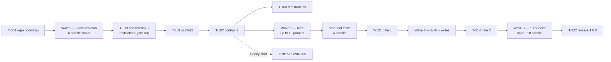

# 09 — Parallel execution plan

Companion to [08-implementation-roadmap.md](08-implementation-roadmap.md). That
document is authoritative for **scope and phase sequencing**; this one decomposes
every work package into small, independently assignable tasks so multiple agents
(or developers) can build concurrently without stepping on each other.

Design principles: **contract-first** (shared types are frozen before fan-out),
**exclusive file ownership** (no two in-flight tasks touch the same file), and
**waves** (fan out only after the wave's keystone tasks merge). A merge conflict
is by definition a bug in this plan — fix the plan, then the branches.

Task IDs are `T-<wave><nn>`; sizes reuse 08's scale (**S** ≤ half a day,
**M** 1–2 days). Where 08 says a Phase-2/3 WP "depends on Phase 1", it means the
*tag*; this plan refines that to true task-level dependencies — tasks marked **⚡**
depend only on frozen contracts and may start before their wave's nominal phase.

---

## 1. Working model

- **One task = one agent session = one branch** (`task/T-<id>-<slug>`), merged by
  the integrator in dependency order. The task's table row below is its card; the
  agent must also read the parent WP row in 08, the corner cases listed in its
  acceptance, and the doc sections the row names.
- **Definition of done (code tasks):**
  1. Only owned files touched (plus tests the task creates).
  2. Every corner-case ID in the acceptance column appears in a test name or
     comment (standing rule 1 of 08).
  3. `npm run check` green locally.
  4. Each acceptance bullet answered with one line in the PR description.
- **Definition of done (docs tasks, Wave 0):** links resolve; terminology and
  numbers (env vars, tool count, presets) match 07/08; no contradiction left with
  the reviews' dispositions. T-019 is the cross-doc gate.
- **Agent briefing template** (paste, fill the placeholders):

  ```
  You are implementing task T-XXX of x-mcp. Read, in order:
    1. docs/09-parallel-execution-plan.md — §1–§4 and your task row
    2. docs/08-implementation-roadmap.md — parent WP <id>
    3. docs/07-corner-cases.md — cases <ids from your acceptance column>
    4. Doc sections named in your task row
  Rules: touch only files your task owns (+ tests you create); frozen contracts
  (09 §3) are read-only; dependency additions go through the integrator; run
  `npm run check` before finishing.
  Deliverable: branch task/T-XXX-<slug>; PR description = one line per
  acceptance bullet + the corner-case IDs your tests reference.
  ```

## 2. Ownership map

Module boundaries from [02-architecture.md](02-architecture.md) §3 double as
ownership boundaries. This plan refines that layout with a few extra files
(`sanitize.ts`, `resolve.ts`, `paginate.ts`, `tooldef.ts`, the `oauth2/` and
`cli/` directories); T-011 folds the refined layout back into docs/02.

Paths are under `src/` unless stated. Every task also owns the tests it creates.

| Path | Owner |
|---|---|
| Root configs (`package.json`, `tsconfig*`, eslint/prettier, `.github/`, `bin/`, `.npmrc`, `.nvmrc`) | T-101, thereafter **integrator only** |
| `core/errors.ts`, `core/ports.ts`, `core/tooldef.ts`, `core/render-shapes.ts` | T-102, thereafter **frozen** (§3) |
| `core/config.ts` | T-110 |
| `core/policy.ts` | T-111 |
| `core/budget.ts` | T-112 |
| `core/registry.ts` | T-113 |
| `core/render.ts`, `core/sanitize.ts` | T-117 |
| `core/resolve.ts` | T-118 |
| `core/paginate.ts` | T-119 |
| `api/http.ts` | T-114 |
| `api/ratelimit.ts` | T-115 |
| `api/errors.ts`, `test/fixtures/errors/` | T-116 |
| `api/oauth2/` | T-201/T-202/T-203 (disjoint files, see cards) |
| `cli/` (authorize, doctor; dispatcher stub from T-101) | T-204, T-205 |
| `api/endpoints/<pkg>.ts` + `tools/<pkg>.ts` + `test/fixtures/<pkg>/` | the package task (**pairing rule** — one owner for all three) |
| `mcp/` + `index.ts` | T-130; Wave 3 additions by T-310/T-311 |
| `scripts/` (docs generator, CI gates) | T-312, T-313 |
| `docs/01` … `docs/05`, README | per Wave-0 assignment; after code starts, docs/03 rows change only together with the registry (same task), until T-312's generator takes over |
| `test/helpers/` | T-103 |

## 3. Frozen contracts

Frozen after T-102 merges: the error taxonomy (classes, `retryable`, `fix`,
remediation-text keys), the ports (`Clock`, `Sleep`, `Random`, `TokenStore`,
dispatcher injection), the `ToolDef` shape (registry-as-data fields), the compact
render shapes (types only), and — from Wave 0 — the env-var table (docs/02 is
canonical) and tool names/count (docs/03 is canonical).

**Change protocol:** a contract change is its own S task, run **solo** — nothing
else in flight that touches the contract. The change lands with: the type edit,
migration of all existing call sites, and a one-line note in the PR naming which
in-flight tasks must rebase. Never widen a contract silently inside a feature
branch.

## 4. Roles & human checkpoints

- **Integrator** — merges in dependency order; sole owner of root configs after
  scaffold; audits each PR's touched-files list against §2; never hand-resolves
  conflicts (a conflict aborts the merge and reopens this plan).
- **Contract owner** — executes §3's change protocol (default: the integrator).
- **Human checkpoints** (cannot be delegated to an agent): T-001 account
  credentials (GitHub repo, npm token/trusted publishing), T-132 and later live
  runs (real credits get spent), T-321 dogfood week, and every release tag.

## 5. Wave overview



| Wave | Keystones (serial) | Max concurrent agents |
|---|---|---|
| 0 | T-001, then T-019 at the end | 6 |
| C | T-101 → T-102 → T-103 | 1–2 |
| 1 | — (fan-out after T-102/T-103) | 10 infra, then 4 tools |
| 2 | T-203 (machine+store integration) | 4–5 |
| 3 | T-312 before T-313/T-316 | ~10 |

---

## 6. Task catalog

### Wave 0 — corpus revision (Phase 0R)

One doc file = one owner; WP-0.4's edits are split by file between T-012 and
T-013. All doc agents work from 07 + 08 + `docs/reviews/` as the spec.

| ID | WP | Size | Owns | Task & acceptance | Needs |
|---|---|---|---|---|---|
| T-001 | 0.9 | S | repo root, `LICENSE`, minimal CI | `git init` + GitHub repo; MIT `LICENSE`; minimal CI; publish `x-mcp-ai@0.0.1` placeholder from CI with `--provenance`. **Human checkpoint** (accounts). | — |
| T-010 | 0.1, 0.10 | M | `docs/01` | Pricing rewrite around pay-per-use + legacy appendix; availability-detection spec (`X_MCP_AVAILABILITY`, conservative default, `auth_status` surfacing, registry gating); live fact-check vs `llms.txt` incl. usage/credits endpoint existence (feeds T-317). | — |
| T-011 | 0.2, 0.5, 0.1 | M | `docs/02` | Refresh state-machine section (single-flight, reload-under-lock, persist-before-use, stale-lock fail-closed, the two canonical tests named); canonical env-var table; profiles/creds conflict rule; token-path defaults incl. Windows; budget §7 → session credit budget, drop usage seeding + `ignore_budget`; one dependency statement; adopt the refined module layout from 09 §2. | — |
| T-012 | 0.3, 0.4 | M | `docs/03` | Merge/cut plan verbatim → 50/50/~28 (49 unconditional until T-317 resolved `x_usage_get` GO); `x_` prefix + description openers; *phase* + *availability* + cost-class columns; dm package redesign (3 event lookups, 30-day note); `media_upload`/`media_status` split; classification fixes (`block_*`, `list_delete` destructive). | — |
| T-013 | 0.6, 0.4 | M | `docs/04` | T10–T17 fold-in; authorize-flow spec (CSRF `state`, one-shot loopback, `--manual`); host-scoping; media default-deny battery; untrusted-content hardening; redaction list; kill-chain appendix; preset table + override-precedence rule; denied-tool resolution as ratified. | — |
| T-014 | 0.7, 0.8 | S | `docs/05` | Injection seams; MCP-protocol test layer; per-file coverage + guard; fixture provenance + refresh; live-suite spend rules; release/versioning policy (public-API definition, 0.x plan, CHANGELOG sections, token-file migration rule, deprecation flow). | — |
| T-015 | 0.8 | S | `README.md` | Status/quick-start refresh against revised docs; version-pin note for 0.x; doc index rows for 07/08/09; "spends real money" warning stub. | T-010 |
| T-019 | gate | S | none (read-only + fix list) | Cross-doc consistency audit (env table, tool count, dep list, budget model, presets); disposition ledger — every finding in the six reviews → doc change or dated won't-fix; exit gate 0R checklist walked. Output: fix list executed by the file owners or directly if trivial. **Re-run 2026-08-07** against the shipped code, since the corpus has moved a long way since Wave 0. Env tables agree four ways (`core/config.ts` ↔ `docs/02` ↔ `README` ↔ `.env.example`); the three apparent mismatches are all intentional and were left alone — the OAuth1 credential quadruple survives only in a comment recording its own T-309 removal plus a test asserting it is now ignored, `X_MCP_POLCY` is a deliberate misspelling illustrating CFG-8's unknown-key detection, and `X_MCP_READ_BUDGET`/`_MODE` sit in a "Removed / never add" list precisely so nobody reintroduces them. Runtime deps are exactly `@modelcontextprotocol/sdk` + `zod`. One real drift found and fixed: `docs/10` §6.3's preset-escalation table and §6.4's DM note were low by exactly one on every row (19/24/29/31/34 "of 38"), because T-317 landed `x_usage_get` into `read:account` — a cell every preset contains — after T-314 wrote the guide; the counts are now 20/25/30/32/35 of 39, measured through `resolvePolicy` + `isCellAllowed` rather than counted by hand. Same sweep found `server.json` still advertising the 50-tool *designed catalog* as if it were the shipped surface, and missing `X_MCP_TOKEN_KEYCHAIN`, `X_MCP_MEDIA_DIR` and the two policy-override vars — fixed, and T-312 now owns a lockstep guard so the registry listing cannot drift from `package.json` again. | T-010…T-015 |

### Wave C — scaffold + contracts (keystones, serial)

| ID | WP | Size | Owns | Task & acceptance | Needs |
|---|---|---|---|---|---|
| T-101 | 1.1 | M | root configs, `.github/`, `bin/` | Family scaffold: `ci.yml` (4 OS legs + launcher probe), `codeql.yml`, dependabot, `.npmrc`/`.nvmrc`, eslint flat + prettier, coverage-guard, bin CJS wrapper + subcommand dispatcher stub, `npm audit` step. `npm run check` green on an empty-but-typed skeleton. | T-019 |
| T-102 | 1.2/1.3/1.5 (types) | M | `core/errors.ts`, `core/ports.ts`, `core/tooldef.ts`, `core/render-shapes.ts` | The frozen contracts (§3): full error taxonomy types incl. `billing`/`budget`/`forbidden` + `retryable`/`fix`; Clock/Sleep/Random/TokenStore/dispatcher ports; `ToolDef` shape; compact render shape types. Types compile; doc-comment each contract with its 07/08 source. | T-101 |
| T-103 | 1.7 (harness) | S | `test/helpers/` | MockAgent helper, InMemoryTransport helper, fixture loader asserting provenance headers (DRIFT-4), fake Clock/Sleep. | T-102 |

### Wave 1 — Phase 1 fan-out

All infra tasks depend only on T-102/T-103 and run in parallel. Tool tasks fan
out once their listed infra merges. Pairing rule applies to T-120…T-123.

| ID | WP | Size | Owns | Task & acceptance | Needs |
|---|---|---|---|---|---|
| T-110 | 1.2 | M | `core/config.ts` | `parseConfig(env, profilesJson?)` per the ratified env table; CFG-1…8. | T-102 |
| T-111 | 1.2 | S | `core/policy.ts` | Two-axis resolution as pure data; presets; deny-wins; POL-2/3/6. | T-102 |
| T-112 | 1.2 | S | `core/budget.ts` | Session credit budget, atomic check-and-reserve; COST-1/2/3/5, CONC-2. | T-102 |
| T-113 | 1.3 | M | `core/registry.ts` | Registry-as-data + the single pipeline wrapper (validation → policy → budget → rate-limit preflight) against ports with fakes; denied-tool annotations + MCP annotations generated; POL-1/5/7, MCP-4. | T-102 |
| T-114 | 1.4 | M | `api/http.ts` | undici client, injectable dispatcher; host-scoped auth, no-redirect-follow, proxy-ignore (AUTH-14, CFG-7); timeouts; GET-retry-once (NET-3); body tolerance (NET-1/2). | T-102 |
| T-115 | 1.4 | S | `api/ratelimit.ts` | Header-driven tracker + preflight; RATE-1…7, CONC-3, PLAT-4. | T-102 |
| T-116 | 1.5 | M | `api/errors.ts`, `test/fixtures/errors/` | Pure `(status, headers, body) → XError` mapping; remediation texts (DX-F13); partial-failure `missing[]` contract (REND-2); fixture corpus with provenance (401, 403 variants, 429, 200-with-errors, HTML 502; REND-7 sentinel). | T-102 |
| T-117 | 1.6 | M | `core/render.ts`, `core/sanitize.ts` | Compact renders (`url`, `note_tweet`, `truncated`, `author`, `result_count`, zero-results note; REND-1…5/9/10); untrusted-content pipeline + zero-width/bidi stripping (REND-6). | T-102 |
| T-118 | 1.6 | S | `core/resolve.ts` | id/@handle/status-URL resolution + cache; REND-8. | T-102 |
| T-119 | 1.6 | S | `core/paginate.ts` | Pagination contract helper; PAGE-1…5. | T-102 |
| T-120 | 1.6 | S | auth pkg (pairing rule) | `x_auth_status` (app-only degraded shape, AUTH-15), `x_rate_limit_status`. | T-113/114/115/116 |
| T-121 | 1.6 | M | posts pkg | `x_post_get` batch (ids/URLs, `missing[]`). | T-113/114/116/117/118 |
| T-122 | 1.6 | M | users pkg | `x_user_get` batch (ids/handles, `"me"` stub). | T-113/114/116/117/118 |
| T-123 | 1.6 | M | search pkg | `x_search_recent`, `x_post_counts_recent`; pagination + zero-results note. | T-113/114/116/117/119 |
| T-130 | 1.7 | M | `mcp/`, `index.ts` | Server wiring + `instructions` (MCP-5); bring-up with a stub tool after T-113; after T-120…123: InMemoryTransport suite (MCP-2), spawn smoke asserting stdout purity (MCP-1), stdin-EOF/SIGTERM (MCP-3), `fatal:` startup contract (CFG-5), launcher probe (MCP-6). | T-110, T-113; final: T-120…123 |
| T-131 | gate | S | none | Exit-gate-1 audit: every P1 case referenced by a passing test; coverage thresholds; 4 CI legs green; fix list to owners. **Traceability re-verified 2026-08-07** — see the sweep recorded on T-214; all 62 `P1` cases are named by tests in a suite that is fully green, so "referenced by a *passing* test" holds rather than merely "referenced". Coverage thresholds are enforced by `npm run check` (c8 90/80/95 + `scripts/coverage-guard.mjs`), not by inspection. **Residue: the current CI legs have never run remotely** — corrected 2026-08-07 after checking the remote rather than assuming: `github.com/IvanBBaev/x-mcp` exists, is public, and its runs are green, but only against the initial commit's simpler workflow (`coverage`, Node 22, Node 24). The four-way `check` matrix incl. Windows, `audit`, `launcher-node12`, `tarball-smoke` and the drift/context-size gates live in an uncommitted `ci.yml`, so they are green in local runs only. Closing this needs a push, not code — see the H1 human checkpoint in `docs/08`. | all Wave 1 |
| T-132 | 1.8 | S | live-test fixtures | Live capture: real `billing` error body → fixture (COST-6); spot-verify 3–4 read fixtures; ≤ 20 reads. **Human checkpoint** (credits). | T-120…123 |

### Wave 2 — Phase 2 (auth + writes)

T-201/202/204/205 are **⚡** — they need only Wave-C contracts plus the WP-0.2
spec, and may start while Wave 1 is still running.

| ID | WP | Size | Owns | Task & acceptance | Needs |
|---|---|---|---|---|---|
| T-201 ⚡ | 2.1 | M | `api/oauth2/machine.ts` | In-memory refresh state machine per WP-0.2: single-flight, reload-on-401, eager-refresh boundary, non-rotating tolerance; fake-clock tests (AUTH-1…4/6/8…12, CONC-1, PLAT-4). | T-102 |
| T-202 ⚡ | 2.1 | M | `api/oauth2/filestore.ts` | File TokenStore: 0600, atomic tmp+rename incl. win32, `O_CREAT\|O_EXCL\|O_NOFOLLOW` locks, stale-lock fail-closed, `version` migration rule (AUTH-5/7, PLAT-1/2). | T-102 |
| T-203 | 2.1 | M | `api/oauth2/index.ts` | Integration: reload-under-lock / adopt-on-disk-pair, persist-before-use; the two canonical tests green. | T-201, T-202 |
| T-204 ⚡ | 2.2 | M | `cli/authorize.ts` | PKCE flow per security spec: CSRF `state`, one-shot 127.0.0.1 listener, `--manual` no-browser mode (AUTH-13/16). | T-102, T-202 |
| T-205 ⚡ | 2.2 | S | `cli/doctor.ts` | Env/paths/perms validation, synced-storage warning (CFG-9), resolved auth+policy print, optional connectivity GET, exit 0/1. | T-102, T-110 |
| T-206 | 2.5 | M | concurrency test suite | Two-process interleaved refresh over shared tmp token file (CONC-4); kill-9 between refresh and persist → clean recovery; stale-lock matrix (AUTH-5/7); runs on the Windows CI leg. | T-203 |
| T-210 | 2.3 | M | posts pkg (extends) | `x_post_create`: composite validation, weighted-length advisory, URL-cost warning, duplicate-403, timeout ambiguity + safe-probe text, thread-resume prose (POST-1…9, COST-4, NET-4); `x_post_delete` idempotent-404. | T-203, Wave 1 |
| T-211 | 2.3 | M | engagement pkg | `*_set` merges: like/repost/bookmark. | T-203, Wave 1 |
| T-212 | 2.3 | M | timelines pkg | `x_timeline_home`/`x_timeline_mentions`/`x_timeline_user`, time bounds + end_time clamp (REND-9). | T-203, Wave 1 |
| T-213 | 2.4 | S | `core/policy.ts` (solo slot) | Presets final (`read-only`/`engage`/`publish`/`manage`/`full`); denied-tool UX final (POL-4/7); `X_MCP_HIDE_DENIED`. Runs solo — touches a Wave-1 file. | T-210…212 |
| T-214 | gate | S | none | Exit-gate-2 audit: P2 traceability; e2e authorize → post → delete from a real client; boundary fact-check + CHANGELOG "Platform changes absorbed". Audit half done 2026-07-31 (the retags recorded in `docs/01` §cost, `docs/03` §availability and `docs/07` POST-8); CHANGELOG carries its "Platform changes absorbed" section. **Full traceability sweep 2026-08-07**, covering exit gates 1–3 in one pass rather than three: of the **110** numbered corner cases in `docs/07`, **106 are named by tests** and the remaining four are `OA1-1…4`, formally dropped by the T-307 NO-GO and already marked as retained-for-the-record — so the drift is zero in *both* directions, no test cites a case the corpus does not define either. **Residue: the e2e authorize → post → delete from a real client is a human checkpoint** — it needs a live X account, a browser for the PKCE consent screen, and real spend, none of which a fixture can stand in for. `test/scenarios/` covers the same call sequences over fixtures, which is a different claim and must not be read as satisfying this line. | all Wave 2 |

### Wave 3 — Phase 3 → 1.0.0

| ID | WP | Size | Owns | Task & acceptance | Needs |
|---|---|---|---|---|---|
| T-301 | 3.1 | M | graph pkg | follow/mute/block `_set` (block destructive), followers/following, `x_user_search` (`app+user`, registers by default, budget-guarded). **Done 2026-07-31.** | Wave 2 |
| T-302 | 3.2 | M | lists pkg | 10 merged list tools; `x_list_delete` destructive. **Done 2026-07-31.** | Wave 2 |
| T-303 | 3.3 | M | media pkg | Chunked upload + `x_media_status`; MEDIA-1, happy paths. **Done 2026-07-31** (APPEND ships JSON `{segment_index, media:base64}` over the frozen http layer; if live capture shows multipart-only, spawn a solo transport-contract task). | Wave 2 |
| T-304 | 3.3 | M | media pkg (after T-303) | Path-security battery (default-deny, realpath, `O_NOFOLLOW`, same-fd sniff), cancellation + progress (MEDIA-2…7). **Done 2026-08-01** (55/55 media tests: escape/symlink/TOCTOU axes, the same-fd sniff beating the extension, mid-APPEND cancellation, per-segment progress). **Scope clarified 2026-08-07:** the progress half is *internal* — a per-segment event seam the package emits, with the protocol notification explicitly left to the composition root. `src/mcp/` does not read `progressToken` and never emits `notifications/progress`, so no progress reaches a client today. | T-303 |
| T-305 | 3.4 | M | dm pkg | Three event lookups + `x_dm_send`; minimized renders, opt-in bodies, retention note (DM-1…4); POL-3/4 gating. **Done 2026-07-31.** | Wave 2 |
| T-306 | 3.5 | S | archive pkg | `x_search_archive`/`x_post_counts_archive`: per the T-010 fact-check these are `app+user`-reachable under pay-per-use → **register by default** (budget-guarded), not availability-gated; the remaining go/no-go is spaces/trends. Deliver the class-gating machinery for future premium/pilot/enterprise tools. **Done 2026-07-31.** | Wave 2, T-010 spec |
| T-307 ⚡ | 3.6 | S | decision record | OAuth1 go/no-go per Q3 (default drop); if go, spawns its own build tasks (OA1-1…4). **Done 2026-07-31 — NO-GO** (`docs/decisions/0001-oauth1-go-no-go.md`); no build tasks spawned. | Wave 2 |
| T-308 | 3.7 | M | `api/oauth2/keychain.ts` | Keychain TokenStore backend (`X_MCP_TOKEN_KEYCHAIN`). **Done 2026-08-02** (subprocess over a native binding because deps are frozen; the secret rides stdin, never argv — macOS `security -i`, since `-w` truncates its prompt at 128 bytes; fail-closed with no in-memory fallback, stderr scrubbed, an injection-proof identifier charset, and the no-cross-process-lock limitation documented + warned once. `api/oauth2/store.ts` now answers "which backend does this Config call for?" for BOTH the serve path and `authorize`, so an operator cannot authorize into one store and serve from the other. **52 tests** over an in-memory keychain emulator that parses the real argv — and, on macOS, the real `security -i` command line off stdin — so `persist → load` round-trips without ever spawning a process or touching a real keychain: the T1 argv guarantee, both platforms' exit-code dialects, the 45 → delete → re-add duplicate dance, the AUTH-9 corrupt-entry matrix, scrubbing of a stderr that echoes the payload, and the AUTH-5 warn-once + FIFO lock. `keychain.ts` 99.2% lines / 96.8% branches, `store.ts` 100%. Two provably dead spots the battery exposed were removed rather than tested around: a `catch` on `Buffer.from(…, 'base64url')`, which Node's lenient decoder can never trigger, and a placeholder `release` arrow that the synchronous Promise executor always overwrites). | T-203 |
| T-309 | 3.7 | S | `core/config.ts` (solo slot) | Profiles file (CFG-3/6). Runs solo — touches a Wave-1 file. Also removes the dead `oauth1` auth mode + credential quadruple from `core/config.ts` and the docs/02 env table per decision 0001 (T-307). **Done 2026-07-31** (the selected profile is the process's single credential source — env credentials alongside a profiles file are refused up front; a conflicting `X_MCP_AUTH_MODE` is fatal, while an explicit token file or policy wins over the profile with a warning and `X_MCP_POLICY_DENY` is never profile-settable; `AUTH_MODES` is now `oauth2 \| app-only`; 43/43 config tests. Handover: the CFG-6 `0600`-permission check on the profiles file belongs to the composition root and is not implemented yet, and profile-sourced secrets are not in `doctor`'s redactor). | Wave 2 |
| T-310 | 3.8 | M | `mcp/structured.ts` | `outputSchema` + `structuredContent` from the same render objects (REND-11); schemas join the public API + contract fixtures. **Done 2026-07-31** (module + 38 schemas, contract fixture, `tools/list` advertising, `structuredContent` on every success, and the `assertOutputSchemaCoverage` startup guard in `mcp/compose`; serialized-map tripwire raised to 48 KiB at a measured 33 KiB — T-313 owns the listing budget). | Wave 1, T-117 |
| T-311 | 3.8 | M | `mcp/` (after T-310) | Cancellation generalized to all in-flight HTTP (MCP-7); parallel tools/call safety test (MCP-8). **Done 2026-08-01** (one `AbortSignal` reaches every in-flight request of a call, including the chunked upload's segment loop; the MCP-8 battery pins that concurrent `tools/call`s share no mutable state and that one call's cancellation cannot abort another's). | T-310 |
| T-312 | 3.9 | M | `scripts/docs-gen`, generated reference | Tool reference generated from the registry; drift gate registry ↔ docs/03 ↔ reference in CI. **Done 2026-08-07.** `docs/reference/tools.md` plus the `GENERATED:TOOLS` regions in README and `docs/03` are machine-owned; `docs/10` §6.3/§6.4 and the `server.json` description counts are asserted but never written. Zero drift found in either direction across all 39 tools. Gate proven non-vacuous by corrupting a count and a policy cell — both failed with a file:line. `npm run docs:check`. | T-301…306, T-310 |
| T-313 | 3.9 | S | `scripts/context-gate` | CI guard: serialized `tools/list` under the fixed byte budget. **Done 2026-08-07.** Measures the server's own outgoing JSON-RPC frame over an in-memory transport pair — the bytes on the wire, not the client's parsed copy — across all six policy configurations, and enforces against the observed maximum rather than an assumed one. Worst case **74,422 B against an 80,000 B cap** (7.0% headroom ≈ three average tools). `X_MCP_HIDE_DENIED=1` only shrinks the listing, pinned by `test/mcp/surface.test.ts`. `npm run gate:context`. | T-310, T-312 |
| T-314 | 3.10 | M | `README.md`, `docs/` user pages | Operator docs: per-client setup (Claude Desktop/Code, VS Code, Cursor), troubleshooting, pricing warning, privacy/data-handling statement (SEC-F7). **Done 2026-07-31** (`docs/10-operator-guide.md`, `docs/11-troubleshooting.md`, `docs/12-privacy.md` written; README rewritten against the real surface — 38 tools / 11 packages, corrected preset counts, git-clone install because the npm name is only reserved, `GENERATED:TOOLS` markers preserved for T-312). | Wave 2 |
| T-315 ⚡ | 3.10 | S | `SECURITY.md`, `.github/ISSUE_TEMPLATE/` | Disclosure policy + issue templates. **Done 2026-07-31** (advisory-only reporting, in/out-of-scope keyed to T1–T17, three issue forms with a secrets warning; two items wait on the remote from T-001: turning on private vulnerability reporting, and confirming GitHub accepts the relative advisory URL in `config.yml`). | T-001 |
| T-316 | 3.10 | S | compatibility matrix doc | Verified matrix: MCP Inspector + Claude Desktop + Claude Code + ≥ 1 third-party. | T-312, T-314 |
| T-317 | 3.11 | S | usage pkg or removal note | `x_usage_get` go/no-go per T-010 fact-check; ship or drop with dated note (COST-1 loop). **Done 2026-07-31 — GO, scoped** (`GET /2/usage/tweets` is reachable under pay-per-use with an app bearer and carries no tier gate, so the tool ships unconditionally: post-read counts against the monthly project cap with an optional per-day / per-app breakdown, beside the local session-spend state. X publishes no spend API, so it reports counts, never dollars, and never seeds the credit estimate — COST-2 holds and the COST-1 loop stays closed by the local estimator). | T-010, Wave 2 |
| T-318 | 3.12 | M | `test/scenarios/` | Walkthroughs A–C as e2e scenario tests over fixtures. **Done 2026-08-02** (13 tests over the composed server: the thread with its image, the mentions triage, the quote-post hunt — each pinning wire bodies, per-step session cost, and the policy boundary the walkthrough claims. **Caught a real defect**: `mcp/compose` registered the unbound default-deny media tools, so `X_MCP_MEDIA_DIR` never reached `x_media_upload` and every upload refused while blaming the operator for a directory they had configured — fixed by registering `createMediaTools({ mediaDir })`, and step 1 is now a genuine end-to-end upload rather than a pinned gap). | T-303, Wave 2 |
| T-319 | 3.12 | S | `.github/` fuzz job (solo slot) | Scheduled fuzz on tool inputs (QA-F15) + one informational mutation run over `core/*` (QA-F14). **Done 2026-08-02** (`scripts/fuzz-tools.mjs` — 7 invariants × 39 tools, hostile corpus + seeded random, offline with a `fetch` tripwire, deterministic replay line per finding; ~95k calls over 6 seeds found **zero product defects**. `scripts/mutate-core.mjs` — AST-based via the existing `typescript` dep, runs in a temp copy of `build/`, informational; weekly `fuzz.yml` where the fuzz job is a hard gate and mutation is `continue-on-error`. **The first run scored 81.5%** and named four real test gaps, all since closed: the `PAGE_BOUNDS` window table was only spot-checked (5 of 9 windows could drift silently), `parsePostId` asserted the error *kind* but never the branch that tells an agent it passed a handle, `preview()`'s 80-point echo cap was unpinned (an amplification path — an oversized argument would land in context verbatim on every retry), and three inclusive-boundary comparisons had no edge test (`usd >= 0` so a legitimately free call is not re-priced from the table, `next <= limit` so landing exactly on the cap reads as 100% rather than "exceeded", `points.length <= max` so a string that just fits is not marked truncated). **Now 95.4%, 62/65**; the three survivors are equivalent mutants — verified by hand, they cannot change observable behaviour — so this is the practical ceiling for these operators). | Wave 1 |
| T-320 | 3.12 | M | audit report in `docs/` | Implementation re-audit vs T1–T17 + kill-chains A–D against real code. | all Wave-3 code |
| T-321 | 3.12 | — | — | ≥ 1 week dogfood, no P1 issues. **Human checkpoint.** | T-318 |
| T-322 | 3.13 | S | release | 1.0.0: walk the acceptance checklist in 08, tag, provenance publish, registry chain, placeholder README replaced, pins dropped. | everything |

---

## 7. Coordination rules

1. **Ownership is exclusive.** A task creates/modifies only its owned files plus
   tests it creates. The integrator rejects PRs that stray.
2. **Frozen contracts change only via §3's solo protocol.**
3. **Root configs and dependency additions go through the integrator** (the dep
   budget is ~2 runtime packages by design — additions are exceptional).
4. **Pairing rule:** a tool package's `tools/` file, `api/endpoints/` file,
   fixtures, and docs/03 rows share one owner per wave.
5. **Solo slots:** a task that must touch another wave's file (T-213, T-309,
   T-319) runs with nothing else in flight on that file.
6. **Wave discipline:** fan out only after the wave's keystones merge; ⚡ tasks
   may start early but merge in dependency order like everyone else.
7. **Gates are tasks** (T-019/T-131/T-214/T-320+T-322): an auditing agent walks
   the exit gate and emits a fix list; fixes go back to the file owners.
8. **Conflicts are plan bugs.** Never hand-resolve a merge conflict between task
   branches; update this document's ownership map first, then redo the branch.
